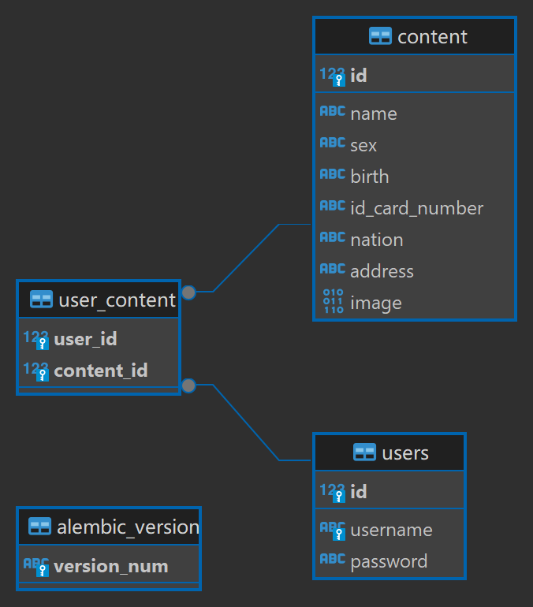

# 基于OCR的小程序卡包  
## 简介  

#### 功能概述 
* 用户注册、登录
* 用户拍摄身份证、查找身份证
* 判别所摄照片信息
* 管理员管理用户信息 


#### 未实现功能
* 部署至公网服务器
* 文档化存储的身份证照片
* 数据传输加密
  
## 技术架构  
#### 技术栈 
* 前端：JavaScript、wxml、wxss、HTML、CSS、Vue
* 后端：Flask、MySQL、Python
* 第三方库：flask_cors、flask_migrate、requests

#### 安装配置
1. 安装Python环境，并安装Flask、MySQL、flask_cors、flask_migrate、requests等第三方库  

在cmd输入以下命令安装
```cmd
pip install Flask
pip install Flask-Cors
pip install Flask-Migrate
pip install requests
```
2. 配置MySQL数据库，导入数据库数据 

3. 配置Flask，连接MySQL数据库  
```python
#配置数据库连接信息
USER = 'root'
PASSWORD = '123456'
HOST = '127.0.0.1'
PORT = '3306'
DATABASE = 'test'
uri ='mysql+pymysql://{}:{}@{}:{}/{}?charset=utf8'.format(USER, PASSWORD, HOST, PORT, DATABASE)
SQLALCHEMY_DATABASE_URI = uri
```
4. 启动`app.py`以启动后端
## 系统流程图
 

